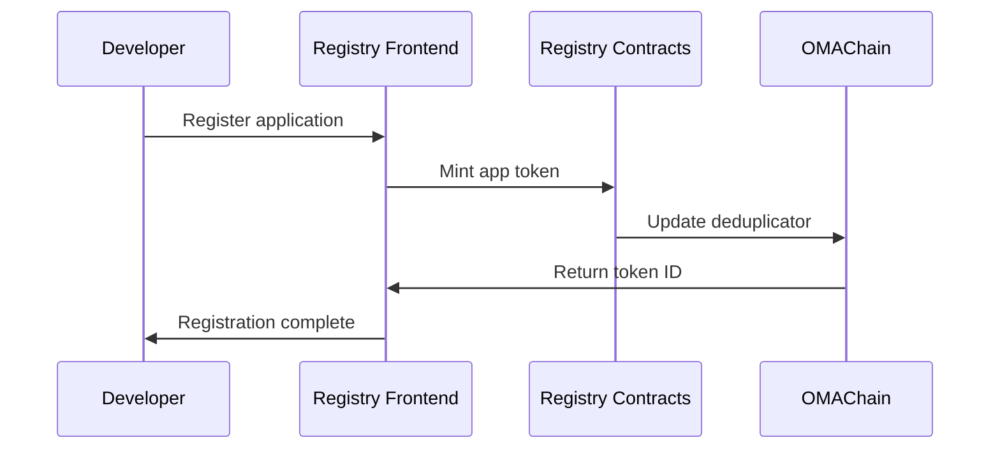
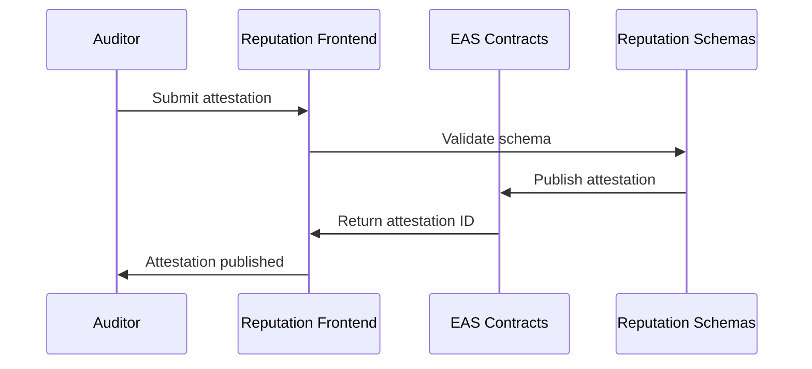
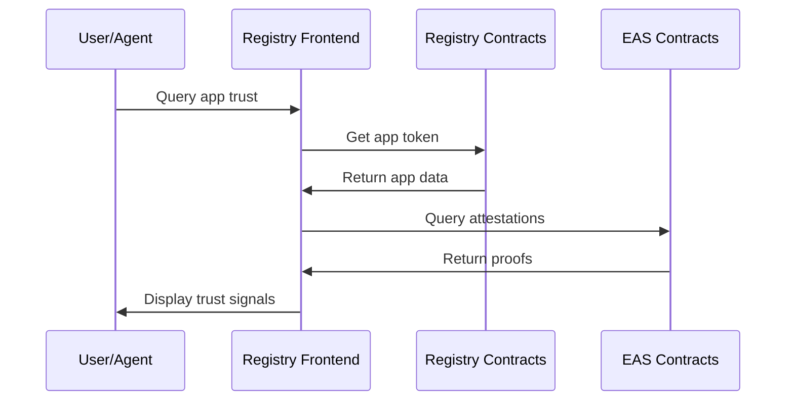

# OMATrust Repository Ecosystem

This document explains how the OMATrust codebase is organized across multiple specialized repositories, and how they work together to create a comprehensive trust layer for the open internet.

## 🏗️ Architecture Overview

OMATrust follows a **modular architecture** where each repository serves a specific function:

```
┌─────────────────────────────────────────────────────────────────┐
│                        OMATrust Ecosystem                       │
├─────────────────────────────────────────────────────────────────┤
│  📚 Documentation Layer                                         │
│  └── omatrust-docs (this repo)                                 │
├─────────────────────────────────────────────────────────────────┤
│  🌐 Frontend Applications                                       │
│  ├── omatrust-registry-frontend                                │
│  └── omatrust-reputation-frontend                              │
├─────────────────────────────────────────────────────────────────┤
│  ⛓️  Smart Contracts & Infrastructure                           │
│  ├── omatrust-registry-contracts                               │
│  └── omatrust-reputation-schemas                               │
├─────────────────────────────────────────────────────────────────┤
│  🔗 Cross-Chain Coordination                                    │
│  └── OMAChain (Ethereum L2)                                    │
└─────────────────────────────────────────────────────────────────┘
```

## 📁 Repository Details

### 🏪 Registry Contracts (`app-registry-evm-solidity`)
**Purpose**: Core smart contracts for the OMATrust App Registry

**Key Components**:
- `OMA3AppRegistry.sol` - Main registry contract for tokenizing applications
- `OMA3AppMetadata.sol` - Metadata management for app tokens
- `OMA3SystemFactory.sol` - Factory for deploying registry instances
- `OMA3ResolverWithStore.sol` - DID ownership resolution and conflict arbitration
- `OMA3DidLib.sol` - Library for DID canonicalization and hashing

**Deployment Targets**:
- Ethereum Mainnet
- OMAChain (primary coordination layer)
- Other EVM-compatible chains

**Key Features**:
- ERC-721 compliant app tokens with extended metadata
- Cross-chain deduplication via resolver contracts
- Versioning and ownership policies
- Gas-optimized for high-volume operations

### 🛡️ Reputation Schemas (`rep-attestation-tools-evm-solidity`)
**Purpose**: Attestation schemas and tools for reputation system

**Key Components**:
- JSON schema definitions for different attestation types
- Deployment scripts for Ethereum Attestation Service (EAS)
- Generated contract interfaces for attestation structures
- Testing frameworks for schema validation

**Schema Types**:
- **User Reviews** - Structured user feedback and ratings
- **Security Certifications** - Audit results and compliance attestations  
- **Linked Identifiers** - Proof of control over multiple identities
- **Endorsements** - Simple organizational vouching
- **Data URL Verification** - Integrity proofs for off-chain metadata

**Integration**:
- Extends EAS with DID-native addressing
- Cross-chain attestation discovery
- Machine-readable proof formats

### 🖥️ Registry Frontend (`app-registry-frontend`)
**Purpose**: Web interface for app registration and discovery

**Technology Stack**:
- Next.js 14 with App Router
- TypeScript for type safety
- Tailwind CSS for styling
- Wagmi for Web3 integration
- Vercel for deployment

**Key Features**:
- App registration wizard with metadata validation
- Search and discovery interface
- Wallet connection and transaction management
- Cross-chain deployment support
- Integration with OMATrust verification APIs

**User Flows**:
- Developers register and manage applications
- Users discover and verify applications
- Auditors can reference registered apps for attestations

### ⭐ Reputation Frontend (`rep-attestation-frontend`)
**Purpose**: Interface for submitting and viewing attestations

**Technology Stack**:
- Next.js with TypeScript
- Integration with EAS APIs
- Real-time attestation status updates
- Mobile-responsive design

**Key Features**:
- Review submission with structured schemas
- Attestation browsing and filtering
- Auditor dashboard for certification management
- Integration with identity verification systems
- Gas-subsidized transactions on OMAChain

**User Types**:
- **End Users** - Submit reviews and view trust signals
- **Auditors** - Publish security certifications
- **Organizations** - Issue endorsements and compliance attestations

## 🔄 Repository Interactions

### Registration Flow


### Attestation Flow


### Verification Flow


## 🚀 Development Workflow

### Local Development
Each repository can be developed independently:

```bash
# Registry contracts
cd app-registry-evm-solidity
npm install && npm run compile && npm test

# Reputation schemas  
cd rep-attestation-tools-evm-solidity
npm install && npm run deploy:testnet

# Frontend applications
cd app-registry-frontend
npm install && npm run dev
```

### Integration Testing
Cross-repository integration uses shared testnet deployments:

1. Deploy contracts to shared testnet
2. Update frontend configuration with contract addresses
3. Run end-to-end tests across all components
4. Validate cross-chain functionality

### Release Process
1. **Contracts**: Deploy to target networks
2. **Schemas**: Publish to EAS on each network
3. **Frontends**: Update contract addresses and deploy
4. **Documentation**: Update this repository with changes

## 🔧 Configuration Management

### Contract Addresses
Maintained in each frontend's configuration:
```typescript
// app-registry-frontend/src/config/contracts.ts
export const REGISTRY_ADDRESSES = {
  ethereum: "0x...",
  omachain: "0x...",
  arbitrum: "0x..."
}
```

### Schema UIDs
Reputation schemas reference specific EAS schema UIDs:
```typescript
// rep-attestation-frontend/src/config/schemas.ts
export const SCHEMA_UIDS = {
  userReview: "0x...",
  certification: "0x...",
  linkedIdentity: "0x..."
}
```

## 📋 Repository Standards

### Code Quality
- TypeScript strict mode enabled
- ESLint + Prettier for consistent formatting
- Comprehensive test coverage (>80%)
- Security audits for all smart contracts

### Documentation
- README with setup instructions
- API documentation for public interfaces
- Architecture decision records (ADRs) for major changes
- Contributing guidelines

### Security
- Multi-signature deployment for mainnet contracts
- Time-locked upgrades where applicable
- Regular dependency audits
- Bug bounty program for critical components

## 🗺️ Future Expansion

### Planned Repositories
- **omatrust-indexer** - Decentralized indexing via Shinzo protocol
- **omatrust-sdk** - Developer SDK for easy integration
- **omatrust-mobile** - Mobile applications for trust verification
- **omatrust-browser-extension** - In-browser trust signals

### Cross-Chain Expansion
- Solana program implementations
- Cosmos SDK modules  
- Layer 2 optimizations
- Interoperability bridges

---

This modular approach ensures each component can evolve independently while maintaining strong integration points. The separation of concerns makes the system more maintainable, testable, and allows different teams to contribute to specific areas of expertise.
